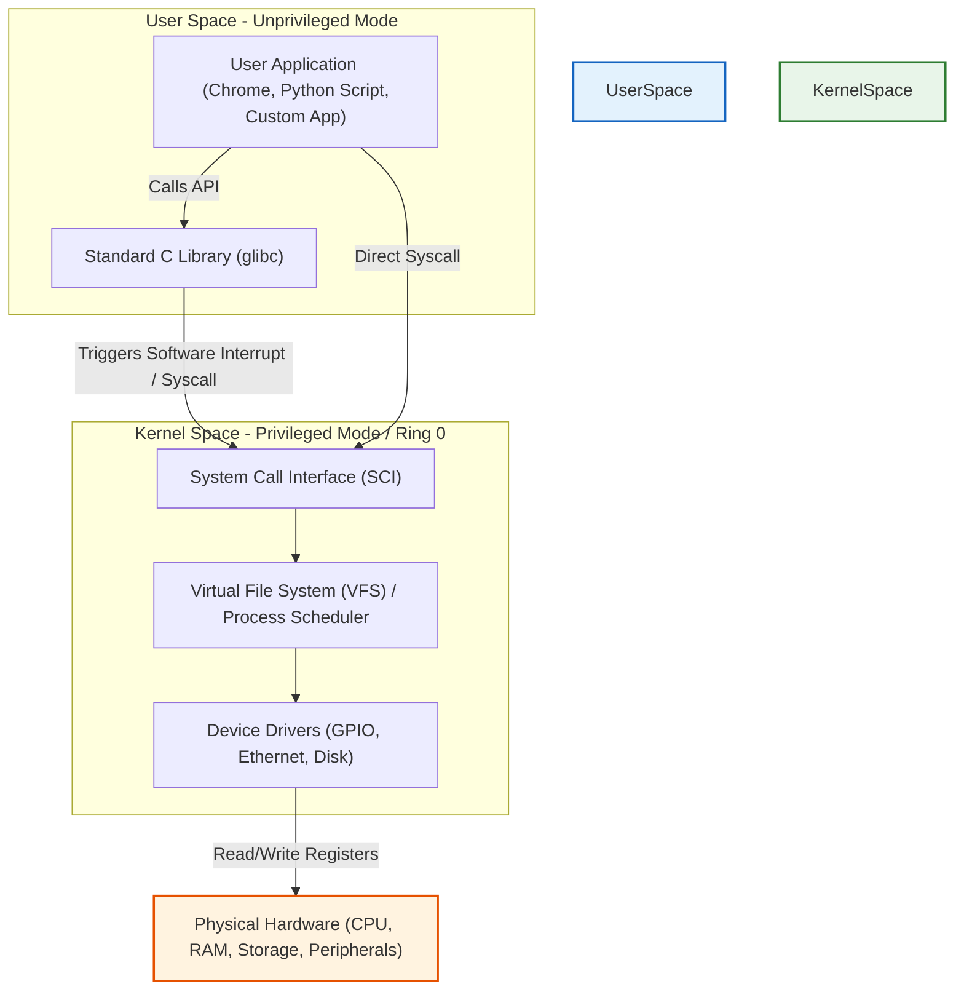
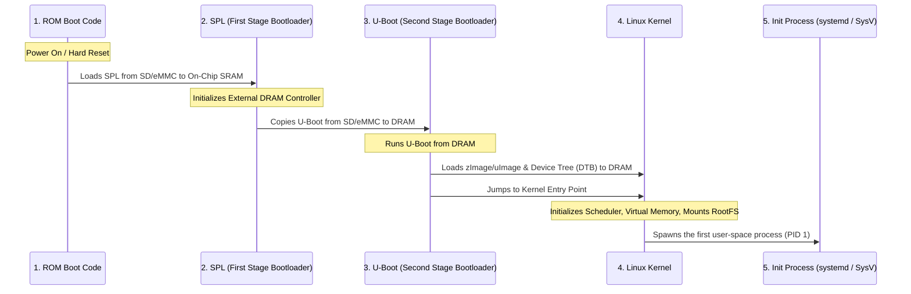

# 🏗️ Stack 03: Embedded Linux Architecture Study Guide

This guide covers the fundamental concepts of operating systems, hardware virtualization, bare-metal vs OS-based design, System-on-Chip (SoC) architectures, Linux user/kernel space separation, and the complete booting sequence of embedded Linux systems.

---

## 1. Why We Need an Operating System (OS)

In simple microcontroller programming (like basic Arduino), the application code runs directly on the hardware without any software intermediary. However, as systems scale, an operating system becomes essential.

### Core Functions of an OS
*   **Hardware Abstraction**: The OS acts as a mediator, abstracting complex hardware interfaces (registers, interrupts, memory controllers) into simple, uniform APIs (like read, write, open).
*   **Resource Management**: Allocates processor time (CPU scheduling), memory space (RAM paging), and peripheral access fairly among multiple running applications.
*   **Concurrency**: Enables multiple tasks to run concurrently (multitasking) via scheduling algorithms, even on a single CPU core.
*   **Security & Isolation**: Protects the system from crashing if a single user application crashes. It isolates process memory spaces so one program cannot corrupt another.

---

## 2. Bare-Metal vs. OS-Based Systems

| Aspect | Bare-Metal System | OS-Based System |
| :--- | :--- | :--- |
| **Architecture** | Direct access to hardware registers from a single super-loop (`while(1)`) or ISRs. | Application code runs in User Space; hardware is accessed via Kernel System Calls. |
| **Task Scheduling** | Co-operative or simple interrupt-driven. No complex scheduling. | Preemptive multitasking scheduler (e.g., completely fair scheduler in Linux). |
| **Complexity** | Low complexity; suitable for small, dedicated functions. | High complexity; handles networking, displays, and complex file structures. |
| **Determinism (Real-time)** | Highly deterministic (exact timing is predictable). | Non-deterministic by default (Linux is general purpose, unless patched with RT-Preempt). |
| **Resource Overhead** | Extremely low memory and CPU footprint. | High overhead (requires megabytes of RAM and storage, plus modern CPU). |

---

## 3. Embedded Linux vs. Embedded Windows

When choosing an operating system for an embedded product, developers frequently compare Embedded Linux (Yocto, Buildroot, Ubuntu Core) and Embedded Windows (Windows IoT).

*   **Cost & Licensing**: 
    *   *Linux*: Open-source, free to modify and deploy without royalty fees.
    *   *Windows*: Proprietary, requiring licensing fees per device.
*   **Customization**:
    *   *Linux*: Fully customizable. Developers can strip the kernel down to a few megabytes and build a minimal root file system from scratch.
    *   *Windows*: Black box; customization is restricted to Microsoft-allowed configurations.
*   **Hardware Support & Portability**:
    *   *Linux*: Supports a vast array of CPU architectures (ARM, x86, MIPS, RISC-V, PowerPC).
    *   *Windows*: Primarily optimized for x86 and limited ARM architectures.
*   **Community and Ecosystem**:
    *   *Linux*: Massive global open-source community providing drivers, middleware, and security patches.
    *   *Windows*: Dependent on Microsoft support cycles and commercial vendor updates.

---

## 4. System-on-Chip (SoC) Architecture

In modern embedded systems, hardware integration has evolved from separate chips on a PCB to a single silicon die containing all core computer components:

*   **Processor Core(s)**: CPU execution engines (e.g., ARM Cortex-A series).
*   **Graphics Processing Unit (GPU)**: Hardware accelerators for rendering displays and graphical UI.
*   **Memory Controller**: Interfaces directly with physical RAM (DDR3/DDR4/LPDDR).
*   **On-Chip SRAM**: Fast, small internal memory used during the initial stages of booting before external RAM is configured.
*   **Peripherals**: Integrated controllers for USB, Ethernet, SD/MMC card interfaces, I2C, SPI, UART, and GPIO.

---

## 5. Linux System Architecture Layers

The Linux operating system separates software execution into two distinct modes to protect the integrity of the system:

### 1. User Space
*   Runs in **unprivileged mode** (CPU Ring 3).
*   Applications cannot access the physical hardware or memory of other processes directly.
*   If a user space program crashes, it throws a segmentation fault but the operating system continues to run safely.
*   Interacts with the kernel using **System Calls** (e.g., `open()`, `read()`, `write()`, `fork()`).

### 2. Kernel Space
*   Runs in **privileged mode** (CPU Ring 0).
*   Has complete, unrestricted access to the CPU instructions, system memory, and hardware registers.
*   Contains core subsystems: Process Scheduler, Virtual File System (VFS), Memory Manager, Network Stack, and Device Drivers.
*   *Warning*: A crash or memory corruption in kernel space results in a full system crash (**Kernel Panic**).

---

## 6. The Embedded Linux Booting Sequence

Booting an embedded Linux board (like a Raspberry Pi or BeagleBone) involves multiple stages because the processor cannot initialize external memory or load a large kernel immediately upon power-up.

### Stage 1: ROM Boot Code (Hardwired)
*   **Location**: Embedded permanently in read-only memory inside the SoC during manufacturing.
*   **Role**: Executes instantly at power-up. It performs basic board checks and looks for boot devices (SD card, eMMC, USB, NAND flash) in a hardcoded priority order.
*   **Action**: Because external RAM (DRAM) is not yet active, it reads the very first sector of the boot device and copies a small program into the tiny **On-Chip SRAM**. This program is the First Stage Bootloader (SPL).

### Stage 2: First-Stage Bootloader (SPL - Secondary Program Loader)
*   **Location**: Initial sectors of SD card or flash storage.
*   **Role**: Initializes the external DDR RAM controller so that the main RAM is ready for use.
*   **Action**: Once DRAM is active, the SPL reads the larger, full-featured Second-Stage Bootloader (U-Boot) from the storage device and loads it into DRAM, then transfers execution control to it.

### Stage 3: Second-Stage Bootloader (U-Boot / Barebox)
*   **Location**: DRAM.
*   **Role**: A highly interactive command-line environment allowing environment variables tuning, network loading, and custom scripts.
*   **Action**: Loads the compressed Linux Kernel image (`zImage` or `uImage`) and the **Device Tree Blob (DTB)** (which describes the hardware layout to the kernel) into DRAM. It passes execution parameters (boot arguments like root partition location) and jumps to the kernel code.

### Stage 4: Linux Kernel Initialization
*   **Location**: DRAM.
*   **Role**: Launches the OS.
*   **Action**: 
    1.  Sets up virtual memory paging and system clocks.
    2.  Uses the Device Tree (DTB) to match and initialize device drivers for the hardware peripherals.
    3.  Mounts the **Root File System (RootFS)** in read-only mode to find user space utilities.
    4.  Spawns `/sbin/init` (PID 1), which is the ancestor of all user space processes.

### Stage 5: Init Process (User Space Launch)
*   **Location**: User Space.
*   **Role**: Launches system services.
*   **Action**: Starts system utilities, brings up network interfaces, mounts remaining file systems in read/write mode, and launches login shell terminals (getty).
