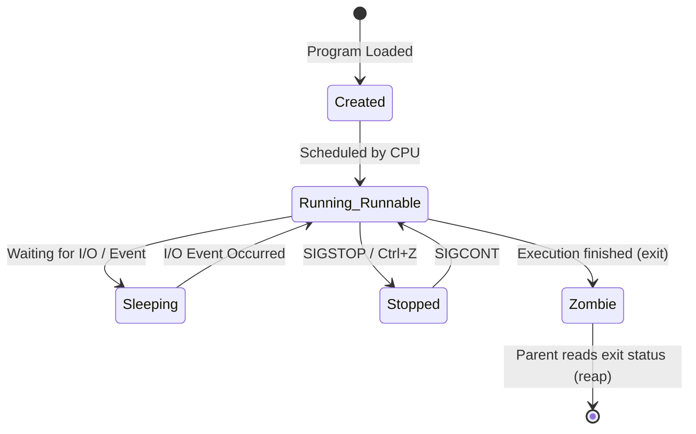

# ⚙️ Stack 05: Process Management Study Guide

This guide covers the core concepts of process execution, lifecycle states, foreground and background multitasking, task prioritization (nice/renice), signaling, and monitoring tools.

---

## 1. What is a Process?

In Linux, there is a clear distinction between a program and a process:
*   **Program**: A static file containing compiled machine instructions stored on secondary disk storage (e.g., `/usr/bin/python3`).
*   **Process**: An active instance of a program loaded into Random Access Memory (RAM). It includes the allocated memory regions, execution registers, system resources, and state.

---

## 2. Process Properties and Lifecycle States

Every process is tracked by the Linux kernel using specific metadata properties:
*   **PID (Process ID)**: A unique integer identifier assigned to each process at creation.
*   **PPID (Parent Process ID)**: The PID of the process that spawned it. Every process (except the root `init` process) has a parent.
*   **TTY**: The terminal interface associated with the process (or `?` if it is a background daemon).
*   **State**: The current execution status of the task.

### Process States (Slide/Notebook concepts)



*   **Running / Runnable (R)**: The process is either currently executing on a CPU core or is waiting in the run queue for scheduler allocation.
*   **Interruptible Sleep (S)**: The process is suspended waiting for an event or resource (like user input or disk read). It can be woken up by a signal.
*   **Uninterruptible Sleep (D)**: The process is waiting directly on hardware I/O. It cannot be interrupted or terminated by any signal until the hardware responds.
*   **Stopped (T)**: The process has been suspended by a signal (like `Ctrl+Z` or SIGSTOP) and will not execute until it receives a SIGCONT signal.
*   **Zombie (Z)**: A process that has finished execution but still has an entry in the kernel's process table so that its parent can read its exit return status code. A zombie process does not consume RAM or CPU, only a process table slot.

---

## 3. Foreground vs. Background Multitasking

When you run a command in a terminal shell, it executes in the **foreground** by default, locking input control of the prompt.

*   **Background Execution (`&`)**: You can append an ampersand to the end of a command to run it in the background, keeping the shell prompt responsive.
    ```bash
    sleep 100 &
    ```
*   **Suspending a Process (`Ctrl+Z`)**: Pauses the current foreground process and puts it into the Stopped state.
*   **Checking Jobs (`jobs`)**: Lists all background jobs spawned by the current terminal session, showing their index and status.
*   **Moving to Foreground (`fg`)**: Brings a background or suspended job back to the foreground:
    ```bash
    fg %1   # Brings job number 1 to the foreground
    ```
*   **Resuming in Background (`bg`)**: Resumes a suspended job in the background:
    ```bash
    bg %1   # Resumes job number 1 running in background
    ```

---

## 4. Process Prioritization: Nice & Renice

In multi-tasking environments, the CPU scheduler must decide which process gets execution time. Linux uses a priority metric called the **Nice value** to influence scheduling.

*   **Range**: Nice values range from **`-20`** (highest priority, gets most CPU time) to **`19`** (lowest priority, "nicest" to other programs, gets leftover CPU time). The default nice value for new processes is `0`.
*   **Permissions**: Only the root superuser can assign negative nice values (increase priority). Normal users can only increase the niceness (decrease priority) of their processes.

### Nice Commands
*   **Launch with custom priority (`nice`)**:
    ```bash
    nice -n 10 python3 script.py    # Starts script with nice value 10 (low priority)
    sudo nice -n -5 python3 script.py # Starts script with nice value -5 (high priority)
    ```
*   **Alter priority of a running process (`renice`)**:
    ```bash
    renice -n 15 -p 1234    # Changes nice value of PID 1234 to 15
    ```

---

## 5. Terminating Processes: Signals

Processes communicate and are controlled via **Signals** sent by the kernel or user.

| Signal Number | Signal Name | Description | Default Action |
| :--- | :--- | :--- | :--- |
| **2** | **SIGINT** | Interrupt signal (triggered by pressing `Ctrl+C`). | Graceful termination |
| **9** | **SIGKILL** | Hard kill. Cannot be ignored or blocked by the process. | Immediate termination by kernel |
| **15** | **SIGTERM** | Standard termination request. Gives process time to save data and clean up resources. | Graceful termination |
| **19** | **SIGSTOP** | Suspend execution. Cannot be ignored or blocked. | Stops the process |
| **18** | **SIGCONT** | Resume execution of a stopped process. | Resumes the process |

### Termination Commands
*   **`kill`**: Sends signals to specific PIDs (default is SIGTERM/15):
    ```bash
    kill 1234         # Sends SIGTERM to PID 1234
    kill -9 1234      # Sends SIGKILL to PID 1234 (hard kill)
    ```
*   **`killall`**: Sends signals to all processes matching a program name:
    ```bash
    killall firefox   # Terminates all Firefox processes
    ```

---

## 6. Process Monitoring Commands

*   **`ps`**: Static list of active processes.
    *   `ps aux`: Shows all running processes on the system across all users, displaying columns like user, PID, CPU%, MEM%, VSZ, RSS, STAT, and command.
    *   `ps -ef`: Standard system-v syntax showing PPID hierarchy.
*   **`top`**: Dynamic real-time interface showing system resources (CPU, RAM, load averages) and sorting tasks dynamically.
*   **`pstree`**: Visualizes parent-child process dependencies in a tree layout.
