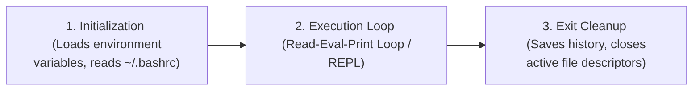

# 🐚 Stack 08: Terminal & Bash Scripting Study Guide

This guide covers the terminal lifecycle interface, shell customization using aliases, command-line manual helper utilities (`tldr`), shell scripting execution, positional arguments, and standard I/O redirection mechanisms.

---

## 1. Terminal vs. Shell & The Lifecycle

It is crucial to understand the distinct roles of the terminal and the shell:
*   **Terminal (Terminal Emulator)**: A graphical application (like GNOME Terminal, xterm, Weylus) that acts as a wrapper. It receives input from standard I/O device drivers (keyboard) and passes it to the shell, and displays the text output from the shell on screen.
*   **Shell**: The command-line command interpreter (like Bash, sh, zsh) that reads your text commands, executes them by making kernel system calls, and prints the outputs.

### Terminal Lifecycle


1.  **Initialization**: When a terminal is opened, the shell starts and reads initialization scripts (e.g., `/etc/profile`, `~/.bashrc`) to build the environment variables (like `$PATH` and `$USER`) and load custom settings.
2.  **Execution Loop (REPL)**: The shell displays a prompt, waits for user command input, parses the input, executes the program, displays the output, and loops back to the prompt.
3.  **Exit Cleanup**: When `exit` is typed or the window is closed, the shell runs exit traps, writes the command history list to `~/.bash_history`, and releases its terminal slot.

---

## 2. Customizing the Environment: Aliases

An **Alias** is a custom shortcut or command name that maps to a longer command string.

*   **Temporary Alias**: Created on the command line. It will disappear as soon as you close the current terminal window.
    ```bash
    alias ll='ls -lah'
    alias update='sudo apt update && sudo apt upgrade'
    ```
*   **Persistent Alias**: To make an alias permanent across shell restarts, it must be written to your shell's initialization file (`~/.bashrc` for Bash).
    1.  Open the file: `nano ~/.bashrc`
    2.  Append the alias line at the bottom: `alias ll='ls -lah'`
    3.  Save and exit.
*   **Reloading Configuration (`source`)**: After modifying `~/.bashrc`, you must tell the active shell to reload the file so changes take effect without needing to open a new terminal:
    ```bash
    source ~/.bashrc
    # Or shorthand:
    . ~/.bashrc
    ```

---

## 3. Help Utilities: `man` vs. `tldr`

*   **`man <command>`**: Displays the official, exhaustive UNIX manual pages for a command. It is highly detailed but can be verbose and difficult to parse quickly.
*   **`tldr <command>`** ("Too Long; Didn't Read"): A community-driven utility that displays clean, practical, and highly summarized command examples. It focuses on the most common 5-10 use cases.
    *   *Example output for `tldr tar`*: Shows command syntax for creating a tarball (`tar -cf`), extracting files (`tar -xf`), and working with gzip compression.

---

## 4. Bash Scripting Basics

A Bash script is a text file containing a sequence of commands executed line-by-line by the shell interpreter.

### 1. The Shebang Line (`#!`)
The first line of any shell script must be the **Shebang** (sharp-exclamation). It tells the kernel which interpreter to use to parse the rest of the script:
```bash
#!/bin/bash
# Or for higher system portability:
#!/usr/bin/env bash
```

### 2. Variable Definitions
*   Variables are defined without spaces around the assignment operator `=`:
    ```bash
    MSG="Hello World"
    ```
*   To read or interpolate a variable, prefix it with a dollar sign `$`:
    ```bash
    echo $MSG
    echo "The message is: ${MSG}"
    ```

### 3. Script Execution
To execute a script, it must have execute permissions:
```bash
chmod +x script.sh
./script.sh
```

### 4. Positional Arguments
When you pass arguments to a script, they are mapped to special positional variables:
*   `$0`: The name of the script itself (e.g. `./script.sh`).
*   `$1`, `$2`, `$3`...: The first, second, and third command line arguments.
*   `$@`: Resolves to a list of all arguments passed.
*   `$#`: The total count of arguments passed.
*   `$?`: The exit code status of the last executed command (where `0` is success, and non-zero is failure).

---

## 5. Input/Output Redirection

By default, every process starts with three default channels (file descriptors):
*   **Standard Input (stdin)**: Descriptor `0` (reads from keyboard).
*   **Standard Output (stdout)**: Descriptor `1` (prints to screen).
*   **Standard Error (stderr)**: Descriptor `2` (prints error logs to screen).

```
                 +-------------+
                 |             | === 1 (stdout) ===> Terminal Screen
 0 (stdin) ====> |   Process   |
                 |             | === 2 (stderr) ===> Terminal Screen
                 +-------------+
```

You can redirect these streams to files or other commands:

### Output Redirection (`>` and `>>`)
*   `>`: Overwrites target file content with stdout.
    ```bash
    echo "Hello" > file.txt   # file.txt now contains only "Hello"
    ```
*   `>>`: Appends stdout to the target file.
    ```bash
    echo "World" >> file.txt  # file.txt now contains "Hello\nWorld"
    ```

### Error Redirection (`2>`)
Redirects error messages only, letting standard output print on the screen.
```bash
ls /nonexistent_folder 2> error.log  # Error details written to error.log
```

### Combining Output and Error (`2>&1`)
Tells the shell to merge Standard Error (descriptor 2) into Standard Output (descriptor 1) so they are written to the same destination:
```bash
./run_server.sh > output.log 2>&1
```

### Suppressing Output (`/dev/null`)
`/dev/null` is a virtual system black hole device file that discards any data written to it. To run a command silently:
```bash
./silent_script.sh > /dev/null 2>&1
```
